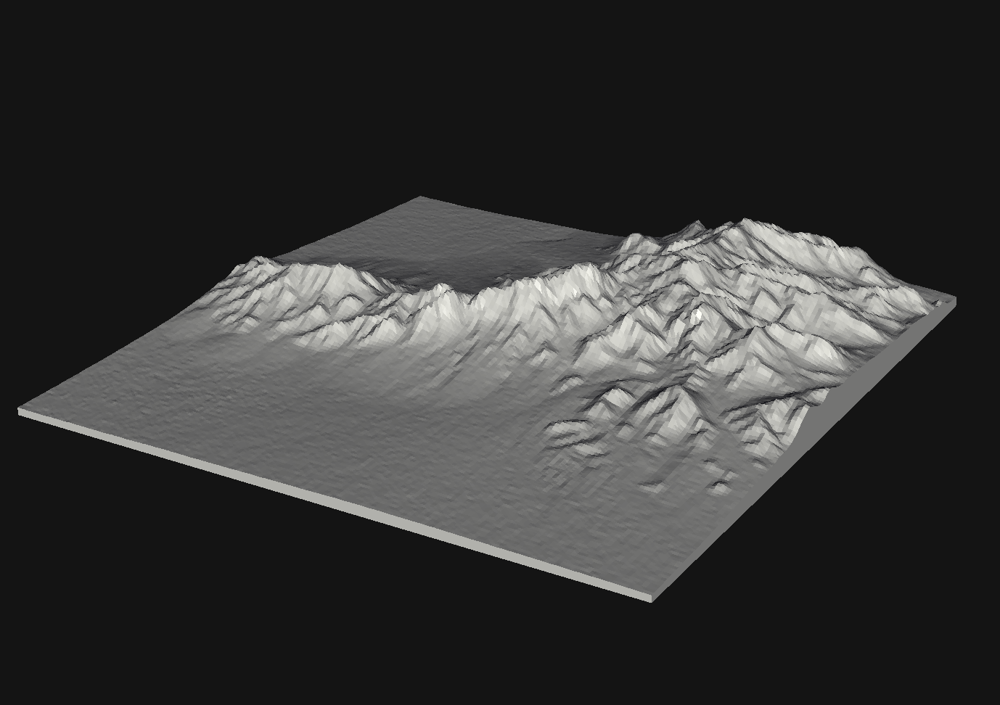

# topostl

A utility for generating printable meshes of terrain.

## Installation

A `setup.py` is provided so you may simply `pip install .` -- doing so in a virtual environment is recommended. Invoke as `topostl`.

## Usage

Currently, this software is designed to use [SRTMGL3 v003](https://lpdaac.usgs.gov/products/srtmgl3v003/) terrain data as input. Simply download the set of granules you need to extract elevations from and store the `.hgt` files in some directory.

To select a region to mesh, you must specify a bounding box in terms of latitude and longitude; e.g. the set of arguments `-n 32.42 -w -106.65 -s 32.2925 -e -106.5` gives you the terrain between 32.2925 N to 32.42 N latitude and 106.65 W to 106.5 W longitude.

At a minimum, you must specify these bounding box parameters along with the input SRTM directory (`-d`) and output STL file (`-o`).

The overall scale of the mesh can be set with the `-f` option; by default, a scale of 0.00001 is used and thus 1 km is represented as 1 cm.

Terrain can be exaggerated using the `-a` option, which defaults to 1.0. This is simply a multiplicative factor for the elevation data.

The depth, in millimeters, of the solid's base extending below the terrain can be set with `-b`. This parameter defaults to 5.0 mm.

An example invocation utilizing all of these parameters could be `topostl -d /data/srtmgl3/ -n 32.42 -w -106.65 -s 32.2925 -e -106.5 -a 1.3 -f 0.0000150 -b 1.25 -o my_mesh.stl`.

The mesh is output with millimeter scale. The base will be axis-aligned and centered at the origin in the x-z plane.

